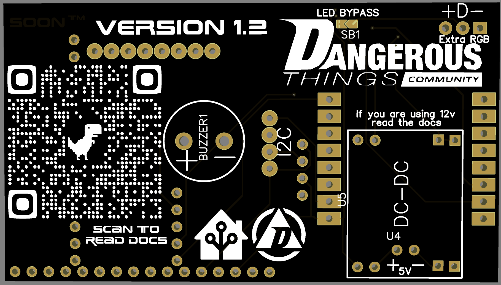

# DT community WI-FI Reader
This is a community built board that helps make use of NFC implants. The inital design was made with Home Assistant in mind and follows [this previouse project](https://github.com/adonno/tagreader). This repo is more for board designs and optomising the readers to work best with implanted devices.

Converstaion was started over on [forum.dangerousthings.com](https://forum.dangerousthings.com/t/rfid-usb-reader-with-home-assistant/16268)

## How to make the boards your self
Anyone can take the Gerber zip file and sent it off to just about any PCB fab. I have used JLCPCB in the past and it worked out great. But I know some fabs are local and give much better shipping times/rates.

## How to mod the board your self
1) Download and install [EasyEDA](https://easyeda.com/) 
2) Open this project in Easy EDA
    1) File -> Open -> EasyEDA -> (location you clones this repo into) -> 8266 NFC reader -> 8266 NFC reader.json
    2) It will then open the schematic for the board. Any changed made will need to update the PCB. In the top menu, Design -> Update PCB -> No, Keep Going
    3) In the menu on the left you will also see a file called 'PCB_8266 NFC reader' open that to show the full board design with traces
3) Once you add or remove anything you want you can use the built in JLCPCB integration to have boards ordered, or you can export the Gerber files and have the boards made anywhere.
    1) You must be in the PCB design file and then go to Fabrication -> PCB fabrication files(gerber)
    
## Design talk

In this picture you can see everything happening inside the board. It's not super crazy, it just makes life a little easier. In this image you can also see the easter eggs placed around.

Here you can see the front of the board as it would really look. You can tell that the easter eggs are not visible in the rendering, but they are faintly in person on the real boards.

The back is basic, has a QR code to the inital forum post and tries to tell you everything you need to know about the board

## Parts list
1) [esp8266 D1 mini](https://www.amazon.com/AITRIP-NodeMcu-Internet-Development-Compatible/dp/B08C7FYM5T/ref=sr_1_3?crid=HAV3ULNUT1Y2&keywords=d1+mini&qid=1662158264&sprefix=d1+mini%2Caps%2C164&sr=8-3)
2) [pn532 nfc reader](https://www.amazon.com/HiLetgo-Communication-Arduino-Raspberry-Android/dp/B01I1J17LC/ref=sr_1_3?crid=38TIEZ6BNQYL7&keywords=pn532&qid=1662158379&sprefix=pn532%2Caps%2C119&sr=8-3)
3) If you are not working with 5v you will need [a DC-DC converter ](https://www.amazon.com/MP1584EN-DC-DC-Converter-Adjustable-Module/dp/B01MQGMOKI/ref=sr_1_37?crid=2YRBOG5B0VW6J&keywords=dc-dc&qid=1662157347&sprefix=dc-dc%2Caps%2C112&sr=8-37&th=1) the board is designed for this one.
